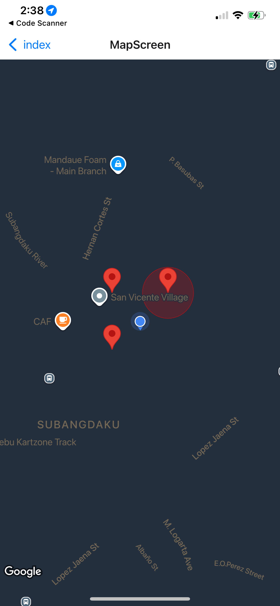
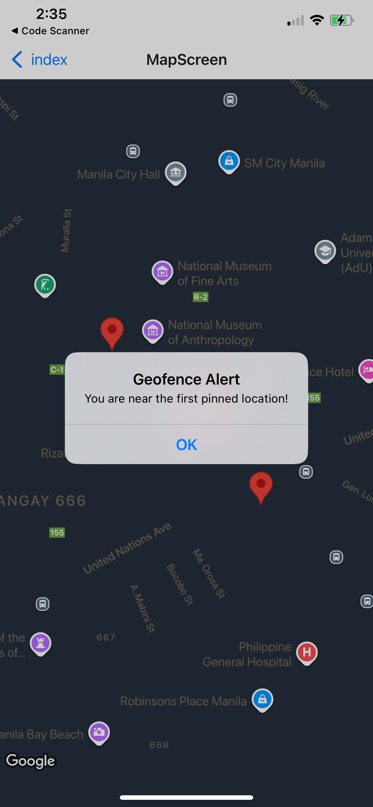
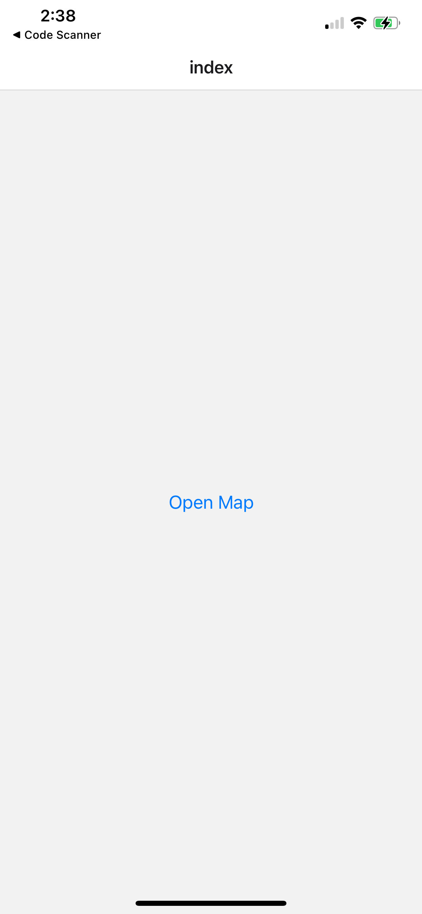

# 🌍 Week 6 Activity 2: Location-Based Map Features

  

---

## 🎯 Objective
For this activity, I enhanced my React Native app to include **real-time location tracking**, **interactive map features**, and **geofencing** using:

- `react-native-geolocation-service`  
- `react-native-maps`  

The goal was to make the app more interactive and responsive to the user's environment.

---

## 🚀 Features Implemented

### 1️⃣ Map Integration
I integrated a map into the app showing **my real-time location** and added **custom markers** for three mock points of interest to make the map engaging.  

---

### 2️⃣ Map Controls & Geofencing
- Added **zoom** and **pan controls** for smooth navigation.  
- Implemented **geofencing alerts** when entering or leaving predefined areas (100-meter radius around markers).  

---

### 3️⃣ Map Customization
- Applied a **dark/high-contrast map style** to enhance readability and visual appeal.  

---

### 4️⃣ Cross-Platform Testing
I tested the app on **both iOS and Android devices** to ensure:
- Location tracking works consistently  
- Map controls and geofencing behave as expected  
- Responsiveness on different screen sizes (phones and tablets)

---

## 💡 Reflections
This activity was exciting because I could see **real-time location updates** in my app—it felt very interactive!  

The geofencing feature was tricky at first because I had to manage permissions and ensure alerts triggered correctly, even in the background.  

Customizing the map style required careful tweaking of JSON styling, but I’m happy with the final look. Overall, implementing these location-based features made my app feel much more dynamic and alive.

---

## 📂 Submission
All the **code**, **screenshots**, and this **README** are included in the repository for review.
